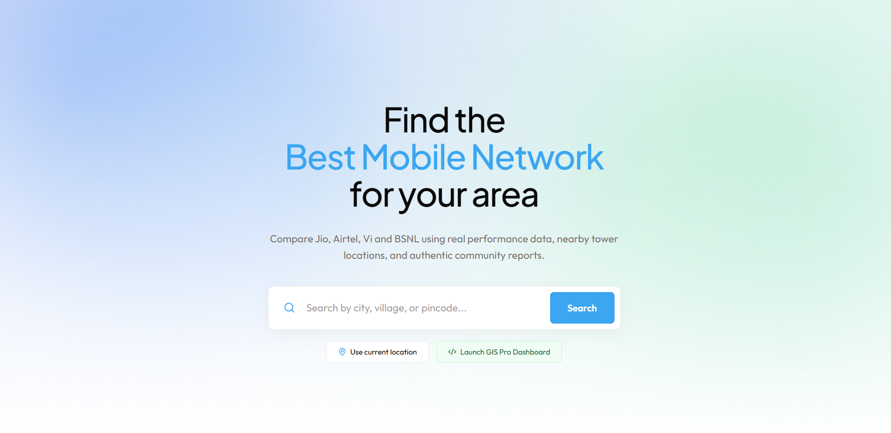
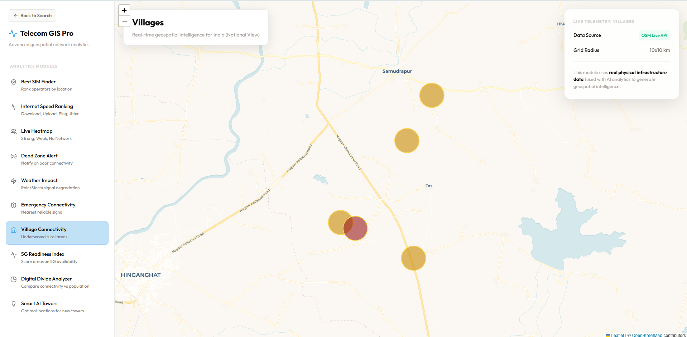
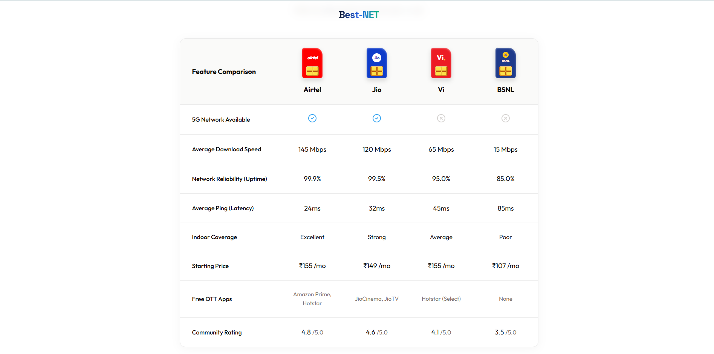
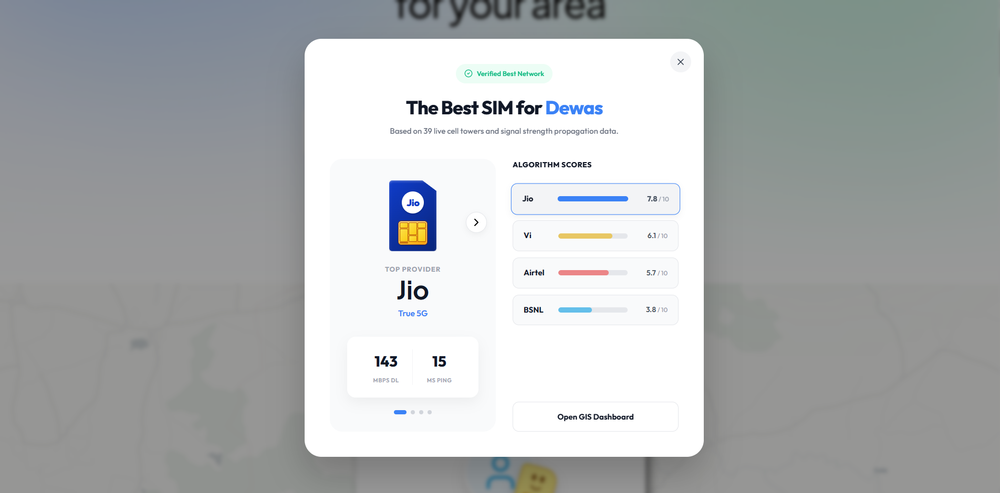

<div align="center">
  
  <h3 align="center">Best SIM Network Analyzer</h3>
  <p align="center">
    <strong>Real-time geospatial intelligence to find the best mobile network in your area.</strong>
    <br />
    <br />
    <a href="https://best-net.vercel.app"><strong>View Live Demo »</strong></a>
    <br />
    <br />
  </p>
</div>

---

<details>
  <summary><strong>Table of Contents</strong> (Click to expand)</summary>
  <ol>
    <li>
      <a href="#about-the-project">About The Project</a>
      <ul>
        <li><a href="#key-features">Key Features</a></li>
      </ul>
    </li>
    <li><a href="#built-with">Built With</a></li>
    <li>
      <a href="#screenshots">Screenshots</a>
      <ul>
        <li><a href="#map-interface">Map Interface</a></li>
        <li><a href="#recommendation-insights">Recommendation Insights</a></li>
      </ul>
    </li>
    <li>
      <a href="#getting-started">Getting Started</a>
      <ul>
        <li><a href="#prerequisites">Prerequisites</a></li>
        <li><a href="#installation">Installation</a></li>
      </ul>
    </li>
    <li><a href="#contributing">Contributing</a></li>
    <li><a href="#license">License</a></li>
  </ol>
</details>

---

## About The Project

<div align="center">
  
</div>

Finding the right mobile network should not rely on biased marketing campaigns or overly complex technical tools. **Best SIM** is a minimalistic, beautifully designed web application that helps you discover the most reliable mobile operator in your specific city, town, or village. 

Think of it as **Speedtest.net**, but highly localized, visually immersive, and actionable. We aggregate thousands of data points, including tower proximity, historical signal strength, and community reports, to give you a definitive recommendation before you purchase your next SIM card.

### Key Features

* **Geospatial Intelligence:** Search any location in India to instantly retrieve network performance metrics. The platform leverages OpenStreetMap routing and forward/reverse geocoding to pinpoint precise coordinates.
* **Deep Dive Analytics:** Compare Jio, Airtel, Vi, and BSNL side-by-side using real performance data. We analyze average download speeds, network uptime, ping, and indoor coverage probabilities.
* **GIS Pro Map:** Interactive map overlays visualizing tower density, 5G readiness, and signal dead zones. Built on Leaflet, the map engine renders dynamic heatmaps based on real physical infrastructure data.
* **Fully Responsive:** Beautifully crafted UI that works seamlessly across desktops, tablets, and smartphones, featuring slide-in drawers and adaptive grid layouts.
* **Performance First:** Built with Next.js App Router for maximum speed, SEO, and SSR capabilities. Components are dynamically imported to minimize initial bundle sizes.

---

## Built With

* [Next.js 16](https://nextjs.org/) - React Framework
* [React 19](https://react.dev/) - UI Library
* [Tailwind CSS](https://tailwindcss.com/) - Utility-first CSS framework
* [Leaflet.js](https://leafletjs.com/) - Interactive Maps
* [Lucide Icons](https://lucide.dev/) - Clean and consistent iconography

---

## Screenshots

### Map Interface
<div align="center">
  
</div>
*The interactive GIS Pro dashboard showing tower heatmaps and signal analysis.*

### Recommendation Insights
<div align="center" style="display: flex; flex-direction: column; gap: 16px; align-items: center;">
  
  
</div>
*Detailed breakdown of operator reliability, rural connectivity mapping, and community scores.*

---

## Getting Started

To get a local copy up and running, follow these simple steps.

### Prerequisites

* Node.js (v18.0.0 or higher)
* npm or pnpm

### Installation

1. Clone the repository
   ```bash
   git clone https://github.com/Va09joshi/BEST-NETWORK-FOUNDER.git
   ```
2. Navigate to the project directory
   ```bash
   cd BEST-NETWORK-FOUNDER
   ```
3. Install dependencies
   ```bash
   npm install
   ```
4. Start the development server
   ```bash
   npm run dev
   ```
5. Open [http://localhost:3000](http://localhost:3000) in your browser.

---

## Contributing

Contributions are what make the open source community such an amazing place to learn, inspire, and create. Any contributions you make are **greatly appreciated**.

1. Fork the Project
2. Create your Feature Branch (`git checkout -b feature/AmazingFeature`)
3. Commit your Changes (`git commit -m 'Add some AmazingFeature'`)
4. Push to the Branch (`git push origin feature/AmazingFeature`)
5. Open a Pull Request

---

## License

Distributed under the MIT License. See `LICENSE.txt` for more information.

---

<div align="center">
  <p>Built with quality by the Best SIM Team</p>
</div>
